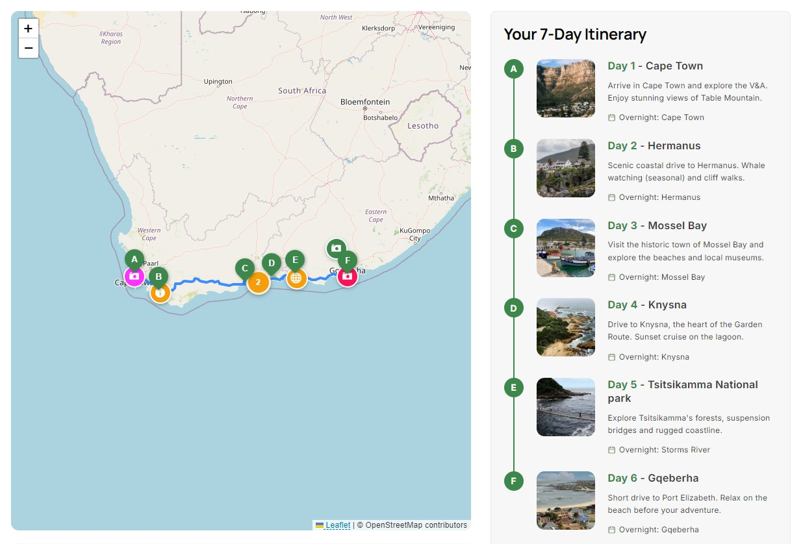

# Examples

Each example demonstrates a different use case and may inspire ideas for your own projects.

### Tourist Route

<figure><figcaption></figcaption></figure>

A guided walking or driving route highlighting attractions, viewpoints and landmarks.

**Ideal for:**

* Tourism websites
* Visitor guides
* Holiday destinations

[View Live Demo **→**](https://baxtersweb.com/baxtersweb-maps-demo/)
